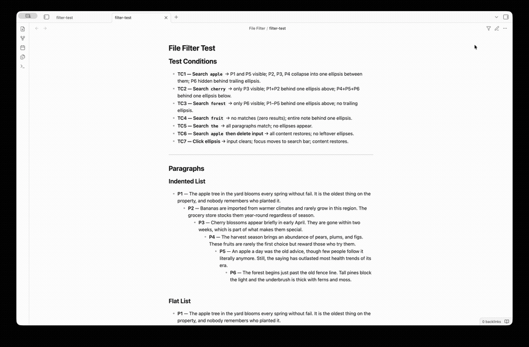

# File Filter

An [Obsidian](https://obsidian.md) plugin with two features: a live filter for the Files pane, and a paragraph-level filter and inline editor for reading mode.

---

## File explorer filter

Click the **filter icon** in the Files pane (leftmost button in the nav bar). A search field appears below the nav buttons.

Type anything — the filter matches against the full file path, including folder names. So searching `boston` would surface:

```
Notes/
  Locations/
    Boston.md
Food/
  Pies/
    Boston Creme Pie.md
```

Press **Escape** or click **×** to clear the filter and return to the normal view.

**Behaviour:**
- Matches any substring of the full path (case-insensitive)
- Folder hierarchy is preserved for every matching file
- Collapsed folders that contain matches are automatically expanded while the filter is active, then restored when cleared
- All file types are included, not just Markdown notes

---

## Paragraph filter (reading mode)

Click the **filter icon** in the note header (or press **Cmd+F**) while in reading mode. A search field appears below the header.

Type anything — non-matching paragraphs are hidden and replaced by a **···** ellipsis. Matching text is highlighted inline.

- Click **···** or press **Escape** to clear the filter
- Press **Cmd/Ctrl+Z** after clicking **···** to restore the previous query
- The filter icon and search bar are hidden in source and live-preview mode

### Preserve structure (setting)



Enable **Preserve structure** in Settings → File Filter to keep ancestor headers visible when filtering a page.

Without this setting, only blocks whose text contains the search term are shown. With it enabled, any header that sits above a matching block in the document hierarchy is also shown — even if the header itself does not contain the search term.

**Example:** searching `apple` in a note structured as:

```
# Fruit Notes
## Varieties
A paragraph about apples.
```

Without *Preserve structure*: only the paragraph is shown.  
With *Preserve structure*: `# Fruit Notes`, `## Varieties`, and the paragraph are all shown.

---

## Paragraph inline editor (reading mode)

In reading mode, hover over any paragraph to reveal a **pencil icon** on the left margin. Click it to open a floating editor with the raw Markdown source for that paragraph.

- Edit the text and press **Tab**, **Escape**, or **OK** to save and close
- Changes are saved directly to the file
- Works with **embedded pages** — clicking the pencil on a paragraph inside an `![[embed]]` opens the correct source file

---

## Other Plugins

Check out [Date List](https://community.obsidian.md/plugins/date-list) and [Calendar List](https://community.obsidian.md/plugins/calendar-list) if you liked this plugin.
