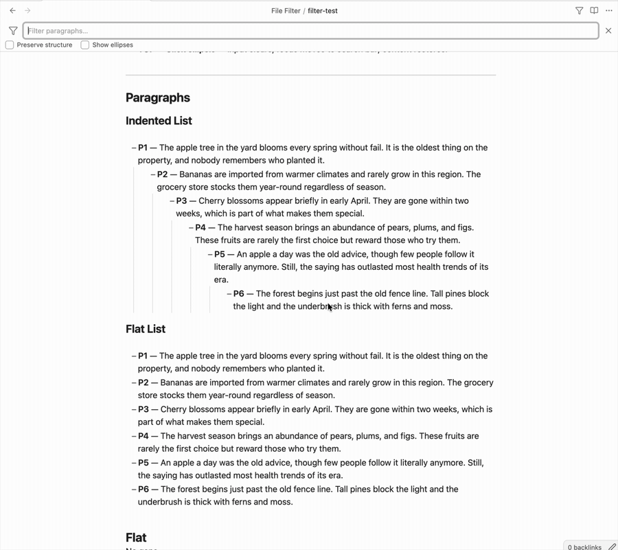
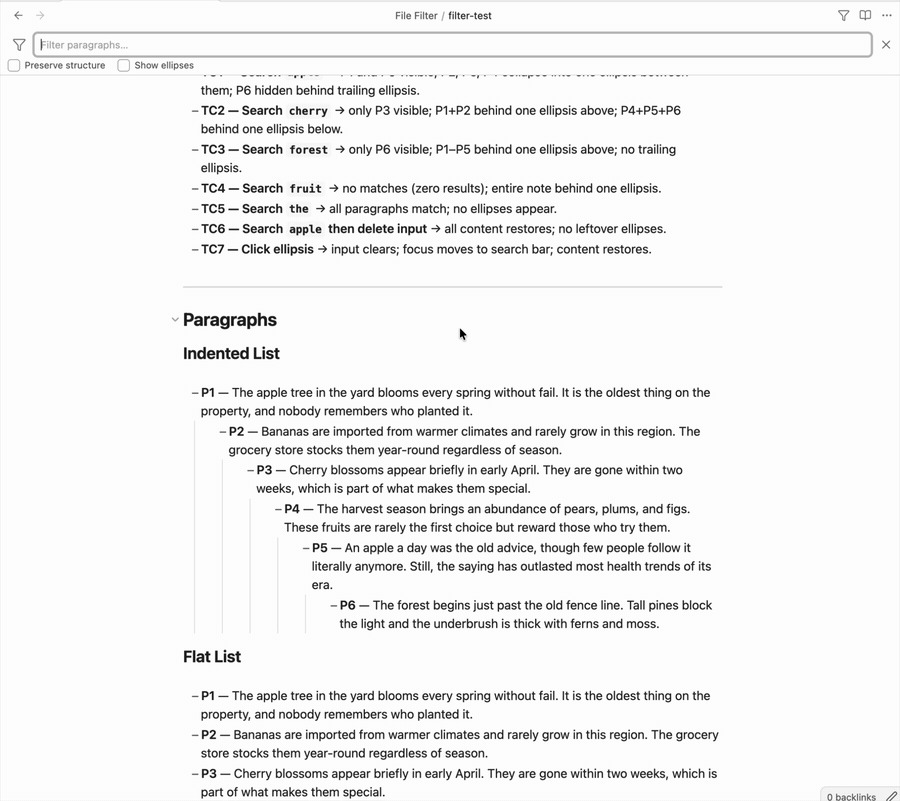

# File Filter

An [Obsidian](https://obsidian.md) plugin with two features: a live filter for the Files pane, and a paragraph-level filter for the editor.

---

## Editor inline filter



Click the **filter icon** in the note header (or press the customizable hotkey **Cmd+F**) and a filter field appears below the header.

Type anything and watch non-matching paragraphs be hidden. Optionally, you can collapse the hidden paragraphs into an **···** ellipsis. Matching text is highlighted inline.

- Click **···** or press **Escape** to clear the filter
- Press **Cmd/Ctrl+Z** after clicking **···** to restore the previous query
- Untick **Show ellipses** (in settings or under the filter input) to hide the **···** separators entirely
- Click the **filter icon at the left of the search bar** to switch to *exclude* mode — matching paragraphs are hidden instead of shown (e.g. filter out `done` tasks). Click again to switch back; closing the bar resets to include mode.

### Task keywords



Three queries also match task syntax, on top of normal text matching:

- `task` or `todo` — also matches unchecked tasks (`- [ ]`)
- `done` — also matches completed tasks (`- [x]`)

So typing `todo` shows every open task on the page, and switching to exclude mode with `done` hides everything already completed. Only the exact keyword triggers this — `done tasks` is matched as plain text.

> **Note:** the filter is designed for editing mode (Live Preview / Source). Filtering in reading mode also works but is known to be buggy.

### Preserve structure (setting)

Enable **Preserve structure** in Settings → File Filter — or use the checkbox under the filter input — to keep ancestor headers visible when filtering a page.

Without this setting, only blocks whose text contains the search term are shown. With it enabled, any header that sits above a matching block in the document hierarchy is also shown — even if the header itself does not contain the search term.

**Example:** searching `apple` in a note structured as:

```
# Fruit Notes
## Varieties
A paragraph about apples.
```

Without *Preserve structure*: only the paragraph is shown.  
With *Preserve structure*: `# Fruit Notes`, `## Varieties`, and the paragraph are all shown.

---

## File explorer filter

Click the **filter icon** in the Files pane (leftmost button in the nav bar). A search field appears below the nav buttons.

Type anything — the filter matches against the full file path, including folder names. So searching `boston` would surface:

```
Notes/
  Locations/
    Boston.md
Food/
  Pies/
    Boston Creme Pie.md
```

Press **Escape** or click **×** to clear the filter and return to the normal view.

**Behaviour:**
- Matches any substring of the full path (case-insensitive)
- Folder hierarchy is preserved for every matching file
- Collapsed folders that contain matches are automatically expanded while the filter is active, then restored when cleared
- All file types are included, not just Markdown notes

---

## Other Plugins

Check out [Date List](https://community.obsidian.md/plugins/date-list) and [Calendar List](https://community.obsidian.md/plugins/calendar-list) if you liked this plugin.
